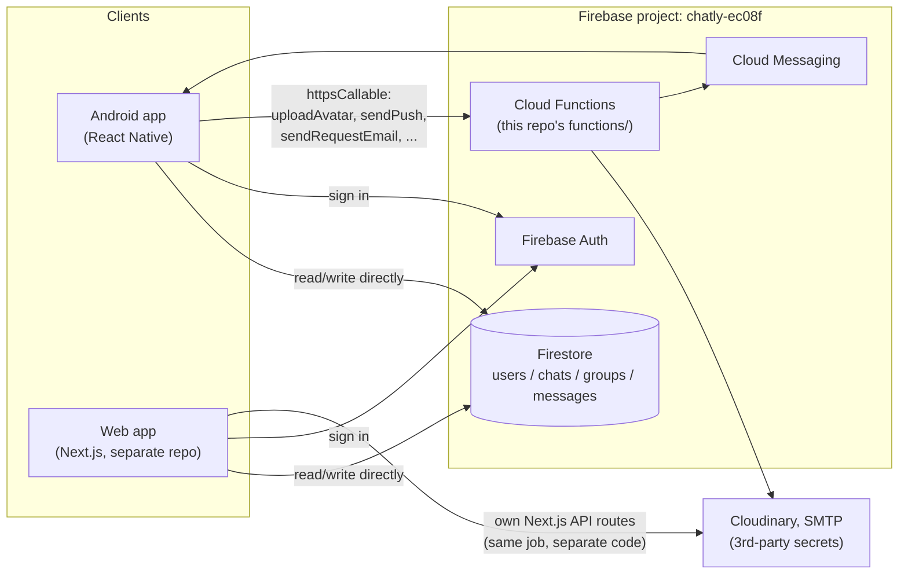

# Chatly

**Real-time 1-on-1 and group messaging, on the web and on Android — one Firebase backend, two clients.**


---

## Table of contents

- [What this repo is](#what-this-repo-is)
- [Features](#features)
- [Architecture](#architecture)
- [Repo structure](#repo-structure)
- [Tech stack](#tech-stack)
- [Getting started](#getting-started)
- [Environment & secrets](#environment--secrets)
- [Building a release APK](#building-a-release-apk)
- [Known limitations / roadmap](#known-limitations--roadmap)
- [License](#license)

## What this repo is

Chatly is a real-time chat application, in the spirit of WhatsApp or Messenger. This repository contains the **native Android client** (React Native, bare CLI) and its **server-side Firebase Cloud Functions** — together, everything needed to run and ship the Android app.

A separate Next.js web client exists outside this repo and shares the same Firebase project, so web and Android users message each other in real time against one shared dataset. See [Architecture](#architecture) for how the two fit together.

## Features

- **Authentication** — email/password sign-up with email verification, password reset, persistent sessions
- **1-on-1 messaging** — request/accept flow before a conversation opens, realtime delivery, read receipts, typing indicators, online/last-seen presence
- **Group messaging** — create groups, admin role, leave group
- **User discovery** — search people by name to start a new conversation
- **Profile** — avatar upload, bio, view another user's profile/contact info
- **Block / unblock** — symmetric enforcement (blocked either direction disables messaging), persisted to Firestore
- **Clear chat** — clear a conversation's history for yourself without affecting the other participant(s)
- **Push notifications** — FCM + on-device display (Notifee), tap-to-open-conversation, with a per-user on/off preference (Settings → Notifications) respected server-side before a push is even sent
- **Light/dark theme** — persisted per-user, shared color tokens with the web app
- **Android-native UX** — safe-area handling, keyboard-avoiding composer, hardware back button, edge-to-edge ready

## Architecture

Chat itself has **no backend** — the mobile client talks directly to Firestore, same as the web client:



**The rule of thumb:** if it's chat data (messages, presence, typing, unread counts, profile fields, block lists), the client reads/writes Firestore directly and Firestore Security Rules enforce access control — no server round-trip. If it requires a secret the client can't hold (SMTP password, Cloudinary API secret, FCM admin send), it goes through `functions/` instead.

The web app has its **own** implementation of that same server-side logic (Next.js API routes using `firebase-admin` directly) rather than calling into `functions/` — the two are independent copies of similar logic that happen to share one Firebase project. There used to be a third copy, a standalone Express server (`backend/`), which was removed once nothing was calling it anymore.

## Repo structure

```
ChatlyApp/
├── mobile/                  React Native (bare CLI) Android app
│   ├── src/
│   │   ├── screens/         Auth, chat, settings screens
│   │   ├── navigation/      React Navigation stacks/tabs
│   │   ├── context/         Auth context (session, live profile)
│   │   ├── lib/             Firebase, Firestore helpers, notifications, API calls
│   │   ├── hooks/           Realtime query hooks (messages, users, chats)
│   │   ├── theme/           Color tokens, light/dark theme
│   │   └── components/      Shared UI (AppText, Avatar, MessageBubble, ...)
│   ├── android/             Native Android project (Gradle, manifest, signing)
│   ├── scripts/setup-firebase.js   Regenerates google-services.json from .env
│   └── README.md
├── functions/               Firebase Cloud Functions (the only server)
│   ├── src/functions/       auth.ts, media.ts, notify.ts
│   └── README.md
├── firebase.json            Firebase CLI config — not a secret
├── .firebaserc              Default Firebase project — not a secret
└── mobile_ui_preview.html   Static HTML mockup, not part of the shipped app
```

## Tech stack

| Layer | Choice |
|---|---|
| Mobile framework | React Native (bare CLI), TypeScript, new architecture enabled |
| Mobile styling | NativeWind (Tailwind for RN) + shared color/typography tokens mirroring the web app |
| Realtime data & auth | `@react-native-firebase` — native Auth/Firestore/Messaging SDKs |
| Server-side | Firebase Cloud Functions, Node.js 20 + TypeScript |
| Navigation | React Navigation (native-stack + bottom-tabs) |
| Push notifications | `@react-native-firebase/messaging` (FCM) + `@notifee/react-native` |
| State/data caching | TanStack Query over Firestore realtime listeners |
| Animation | react-native-reanimated + Moti |
| Media | Cloudinary (avatar storage/transforms) |

## Getting started

### Prerequisites

- Node.js ≥ 22.11, npm
- JDK 17+, Android SDK (`ANDROID_HOME` set), an emulator or a USB-debugging-enabled device
- A Firebase CLI login (`firebase login`) with access to the `chatly-ec08f` project

### 1. Cloud Functions

```bash
cd functions
npm install
cp .env.example .env   # fill in non-secret config
firebase functions:secrets:set SMTP_PASS
firebase functions:secrets:set CLOUDINARY_API_SECRET
npm run serve           # local emulator, or `npm run deploy` for real
```

Full detail: [`functions/README.md`](functions/README.md).

### 2. Mobile app

```bash
cd mobile
npm install
cp .env.example .env    # then follow the Firebase Console step below
npm run android          # builds + installs a debug build on your device/emulator
```

Full detail, including the one manual Firebase Console step (registering the Android app to get `google-services.json`) and Windows-specific path-length notes: [`mobile/README.md`](mobile/README.md).

## Environment & secrets

Nothing secret is committed. `.firebaserc` and `firebase.json` are plain CLI config; actual credentials live in gitignored `.env` files:

| File | Holds | Notes |
|---|---|---|
| `functions/.env` | SMTP host/port/user, Cloudinary cloud name + key | The two truly sensitive values (`SMTP_PASS`, `CLOUDINARY_API_SECRET`) are set via `firebase functions:secrets:set`, never written to disk |
| `mobile/.env` | `GOOGLE_SERVICES_JSON_BASE64` | Decoded into the real `android/app/google-services.json` by `npm run setup:firebase` — that generated file is also gitignored |

## Building a release APK

```bash
cd mobile
npm run setup:firebase          # regenerate google-services.json from .env
cd android
./gradlew assembleRelease
```

Output: `android/app/build/outputs/apk/release/app-universal-release.apk` (plus per-ABI APKs for `arm64-v8a` and `armeabi-v7a`).

> **Before a real Play Store submission:** the release build currently reuses the debug keystore (fine for sideloading/internal testing, not for Play Store). Generate a real upload keystore and wire it into `android/app/build.gradle`'s `signingConfigs.release` first.

## Known limitations / roadmap

Present in the shared Firestore schema or on the web app, but not yet built on mobile:
- Message editing, delete-for-everyone, forwarding, multi-select
- Group member add/remove, group name/photo editing
- Editing profile fields beyond avatar/bio (display name, phone, location)
- Conversation pin/archive/delete
- Admin portal (web-only)

## License

Proprietary — all rights reserved. Update this section if the project is later open-sourced or licensed differently.
