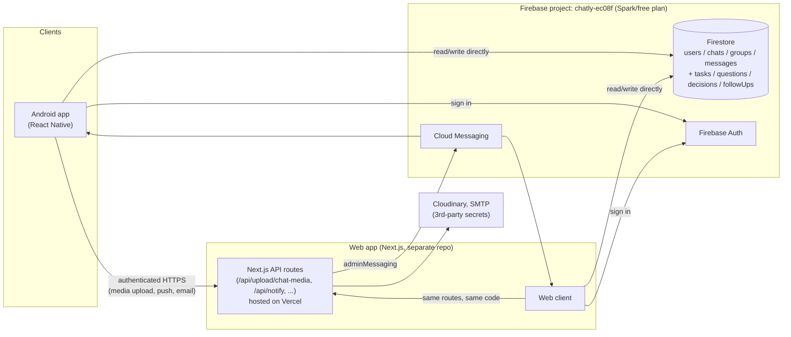

# Chatly

**Real-time 1-on-1 and group messaging, on the web and on Android — one Firebase backend, two clients.**


---

## 📥 Download the App

You can download the latest pre-built APK from the GitHub Releases page:

**[Download latest Chatly.apk](https://github.com/mzeeshanh-dev/chatly-android-app/releases/latest)**

---

## Table of contents

- [What this repo is](#what-this-repo-is)
- [What makes Chatly different](#what-makes-chatly-different)
- [Features](#features)
- [Architecture](#architecture)
- [Server architecture — why no Cloud Functions](#server-architecture--why-no-cloud-functions)
- [Firestore security rules](#firestore-security-rules)
- [Repo structure](#repo-structure)
- [Tech stack](#tech-stack)
- [Getting started](#getting-started)
- [Environment & secrets](#environment--secrets)
- [Building a release APK](#building-a-release-apk)
- [Known limitations / roadmap](#known-limitations--roadmap)
- [Future roadmap](#future-roadmap)
- [License](#license)

## What this repo is

Chatly is a real-time chat application, in the spirit of WhatsApp or Messenger. This repository contains the **native Android client** (React Native, bare CLI) and its **server-side Firebase Cloud Functions** — together, everything needed to run and ship the Android app.

A separate Next.js web client exists outside this repo and shares the same Firebase project, so web and Android users message each other in real time against one shared dataset. See [Architecture](#architecture) for how the two fit together.

## What makes Chatly different

Unlike a straight WhatsApp/Messenger clone, Chatly treats conversations as actionable information rather than just a message log. Any message can be tagged as a **Question** (tracked until answered), a **Decision** (recorded for later reference), or a **Task** (assigned, with a due date) — each shows up in that conversation's own Questions/Decisions/Tasks view instead of getting lost in scrollback. A personal **Follow-up** reminder can be attached to any message. Reopening a conversation after a while surfaces a small non-AI "while you were away" digest — unread count plus open questions/tasks/decisions, computed live from Firestore. See [Future roadmap](#future-roadmap) for where this direction could go next (AI-assisted digesting, conversation memory, and more).

## Features

- **Authentication** — email/password sign-up with email verification, password reset, persistent sessions
- **1-on-1 messaging** — request/accept flow before a conversation opens, realtime delivery, read receipts, typing indicators, online/last-seen presence
- **Group messaging** — create groups, admin role, leave group
- **User discovery** — search people by name to start a new conversation
- **Media messages** — image, generic file, and voice-note attachments, 10MB cap enforced client- and server-side, uploaded to Cloudinary via the web app's Vercel API
- **Questions** — mark any message as a question; tracked open/answered per conversation
- **Decisions** — record a message as a decision; kept in a per-conversation Decisions list
- **Tasks** — turn a message into an assigned task with an optional due date; tracked pending/done
- **Follow-ups** — attach a personal "remind me" reminder to any message; delivered as a local device notification on mobile, shown in the tracked-items list on web
- **Digest banner** — a non-AI "while you were away" summary (unread count + open questions/tasks/decisions) shown when reopening a conversation, computed live from Firestore
- **Presence dots** — a DM contact's avatar shows green (online), red (blocked, either direction, and online), or yellow (request still pending)
- **Profile** — avatar upload, bio, view another user's profile/contact info
- **Block / unblock** — symmetric enforcement (blocked either direction disables messaging), persisted to Firestore
- **Clear chat** — clear a conversation's history for yourself without affecting the other participant(s)
- **Push notifications** — FCM + on-device display (Notifee), tap-to-open-conversation, with a per-user on/off preference (Settings → Notifications) respected server-side before a push is even sent
- **Crash reporting** — Firebase Crashlytics captures native crashes automatically and JS errors via a global handler + the app's `ErrorBoundary`; visible in the Firebase Console → Crashlytics
- **Light/dark theme** — persisted per-user, shared color tokens with the web app
- **Android-native UX** — safe-area handling, keyboard-avoiding composer, hardware back button, edge-to-edge ready

## Architecture

Chat itself has **no backend** — the mobile client talks directly to Firestore, same as the web client. Denormalized counts (open questions, pending tasks) are also computed client-side from live listeners, not by a server:



**The rule of thumb:** if it's chat data (messages, presence, typing, unread counts, profile fields, block lists, tasks/questions/decisions/follow-ups), the client reads/writes Firestore directly and Firestore Security Rules enforce access control — no server round-trip. If it requires a secret the client can't hold (SMTP password, Cloudinary API secret, FCM admin send), it goes through the web app's Next.js API instead — see [Server architecture](#server-architecture--why-no-cloud-functions) for why that's the web app and not Firebase Cloud Functions.

## Server architecture — why no Cloud Functions

This project deliberately runs with **zero Firebase Cloud Functions deployed**, on the free Spark plan. Firebase requires the paid Blaze plan to deploy *any* Cloud Function (even one that never gets invoked) — Blaze has a generous free quota that would likely mean $0/month for an app this size, but it requires a card on file and no automatic spending cap, so this project stays on Spark instead.

Every privileged operation mobile needs — uploading chat media (hides the Cloudinary API secret), sending a push notification (needs the FCM Admin SDK), sending a rejection/request email (needs SMTP credentials) — is instead served by **the Chatly web app's own Next.js API routes**, already deployed on Vercel, already used by the web app for itself, and entirely unrelated to Firebase billing (`firebase-admin` talking to Firestore/Auth/FCM from a server doesn't require the Blaze plan — only *deploying a Cloud Function on Firebase's own infrastructure* does). Mobile just makes an authenticated HTTPS call to the same routes:

| Need | Route | Notes |
|---|---|---|
| Chat media upload | `POST /api/upload/chat-media` | Verifies the caller's Firebase ID token + chat/group membership server-side before touching Cloudinary |
| Message push notification | `POST /api/notify` | Client-triggered right after the Firestore write succeeds (both platforms do this themselves — no Firestore-trigger function watching for new messages) |
| Rejection / request email | `POST /api/notify/rejection`, `/api/notify/request` | Same auth check |

All three require an `Authorization: Bearer <Firebase ID token>` header — a real fix made alongside this change, since none of them checked auth at all beforehand.

Two features that would normally live in a scheduled/triggered Cloud Function are handled differently here instead:
- **Tag counters** (open questions, pending tasks, decisions) — computed live client-side from the `questions`/`tasks`/`decisions` subcollections (`useTrackedItemCounts`), not maintained by a Firestore trigger.
- **Follow-up delivery** — mobile schedules a real local device notification via Notifee's trigger-notification API at the time the reminder is set (no server needed to fire it later); web shows follow-ups in the tracked-items list but can't proactively alert you without either a server or a service-worker Push subscription, so it's visual-only there.

The `functions/` directory in this repo (Cloud Functions source) is kept as **reference/legacy code**, not part of the running system — nothing in `mobile/` or the web app currently depends on it being deployed. If this project ever moves to the Blaze plan, it's a valid starting point (Firestore triggers for the counters, a scheduled function for follow-ups, etc.), but as shipped today it's inert. See [`functions/README.md`](functions/README.md) for details.

The web app additionally keeps its **own** duplicate implementation of the avatar-upload logic (`/api/upload`, pre-dating this change, not touched) rather than sharing code with `/api/upload/chat-media` — noted, not refactored, as part of this round.

## Firestore security rules

`firestore.rules` (repo root, registered in `firebase.json`) is the **first version-controlled Firestore rules file in this repo** — previously there was none at all, meaning access control was either fully open or managed unversioned directly in the Firebase Console. It covers:

- `users` — readable by any signed-in user (search, profiles), writable only by the owner.
- `chats/{chatId}` and `groups/{groupId}` (+ their `messages`/`tasks`/`questions`/`decisions` subcollections) — readable/writable only by participants/members, checked via `get()` against the parent doc.
- `followUps` — a top-level, owner-only collection (personal reminders, not shared with the rest of the conversation).
- `otps` — currently `allow read, write: if true` (fully open) in the actual live rules this file mirrors; not tightened as part of this round since nothing in the current app writes there in a way that needed changing.

**Before deploying this for the first time**, diff it against whatever is currently live for the `chatly-ec08f` project in the Firebase Console — a mismatch could tighten or loosen access in ways that surprise the running apps. Deploy with:

```bash
firebase deploy --only firestore:rules
```

## Repo structure

```
ChatlyApp/
├── mobile/                  React Native (bare CLI) Android app
│   ├── src/
│   │   ├── screens/         Auth, chat, settings screens
│   │   ├── navigation/      React Navigation stacks/tabs
│   │   ├── context/         Auth context (session, live profile)
│   │   ├── lib/             Firebase, Firestore helpers, notifications, API calls
│   │   ├── hooks/           Realtime query hooks (messages, users, chats)
│   │   ├── theme/           Color tokens, light/dark theme
│   │   └── components/      Shared UI (AppText, Avatar, MessageBubble, ...)
│   ├── android/             Native Android project (Gradle, manifest, signing)
│   ├── scripts/setup-firebase.js   Regenerates google-services.json from .env
│   └── README.md
├── functions/               Firebase Cloud Functions — reference/legacy, NOT deployed (see "Server architecture")
│   ├── src/functions/       auth.ts, media.ts, notify.ts, tags.ts, followups.ts
│   └── README.md
├── firebase.json            Firebase CLI config — not a secret
├── firestore.rules          Firestore security rules (see above) — author-reviewed, not auto-deployed
├── .firebaserc              Default Firebase project — not a secret
└── mobile_ui_preview.html   Static HTML mockup, not part of the shipped app
```

## Tech stack

| Layer | Choice |
|---|---|
| Mobile framework | React Native (bare CLI), TypeScript, new architecture enabled |
| Mobile styling | NativeWind (Tailwind for RN) + shared color/typography tokens mirroring the web app |
| Realtime data & auth | `@react-native-firebase` — native Auth/Firestore/Messaging SDKs |
| Server-side | The web app's Next.js API routes (Vercel) — see [Server architecture](#server-architecture--why-no-cloud-functions). `functions/` (Firebase Cloud Functions) exists as unused reference code only |
| Navigation | React Navigation (native-stack + bottom-tabs) |
| Push notifications | `@react-native-firebase/messaging` (FCM) + `@notifee/react-native` |
| State/data caching | TanStack Query over Firestore realtime listeners |
| Animation | react-native-reanimated + Moti |
| Media | Cloudinary (avatar + chat image/file/voice-note storage/transforms) |
| Attachment picking | `react-native-image-picker`, `@react-native-documents/picker`, `react-native-audio-recorder-player`, `react-native-fs` |
| Crash reporting | `@react-native-firebase/crashlytics` |

## Getting started

### Prerequisites

- Node.js ≥ 22.11, npm
- JDK 17+, Android SDK (`ANDROID_HOME` set), an emulator or a USB-debugging-enabled device
- A Firebase CLI login (`firebase login`) with access to the `chatly-ec08f` project

### 1. Mobile app

```bash
cd mobile
npm install
cp .env.example .env    # then follow the Firebase Console step below
npm run android          # builds + installs a debug build on your device/emulator
```

Full detail, including the one manual Firebase Console step (registering the Android app to get `google-services.json`) and Windows-specific path-length notes: [`mobile/README.md`](mobile/README.md).

Media upload, push notifications, and transactional email all go through the Chatly **web app's** Vercel deployment (`mobile/src/config/constants.ts`'s `WEB_API_BASE_URL`) — there's no local server to run for mobile to work.

### 2. Cloud Functions (optional — not required to run the app)

Not deployed, not needed — see [Server architecture](#server-architecture--why-no-cloud-functions). Kept only as reference code for a future Blaze-plan upgrade:

```bash
cd functions
npm install
npm run build   # type-checks; there is nothing to deploy on the free plan
```

Full detail: [`functions/README.md`](functions/README.md).

## Environment & secrets

Nothing secret is committed. `.firebaserc` and `firebase.json` are plain CLI config; actual credentials live in gitignored `.env` files:

| File | Holds | Notes |
|---|---|---|
| `functions/.env` | SMTP host/port/user, Cloudinary cloud name + key | The two truly sensitive values (`SMTP_PASS`, `CLOUDINARY_API_SECRET`) are set via `firebase functions:secrets:set`, never written to disk |
| `mobile/.env` | `GOOGLE_SERVICES_JSON_BASE64` | Decoded into the real `android/app/google-services.json` by `npm run setup:firebase` — that generated file is also gitignored |

## Building a release APK

```bash
cd mobile
npm run setup:firebase          # regenerate google-services.json from .env
cd android
./gradlew assembleRelease
```

Output: `android/app/build/outputs/apk/release/app-universal-release.apk` (plus per-ABI APKs for `arm64-v8a` and `armeabi-v7a`).

> **Before a real Play Store submission:** the release build currently reuses the debug keystore (fine for sideloading/internal testing, not for Play Store). Generate a real upload keystore and wire it into `android/app/build.gradle`'s `signingConfigs.release` first.

## Known limitations / roadmap

Present in the shared Firestore schema or on the web app, but not yet built on mobile:
- Message editing, delete-for-everyone, forwarding, multi-select
- Group member add/remove, group name/photo editing
- Editing profile fields beyond avatar/bio (display name, phone, location)
- Conversation pin/archive/delete
- Admin portal (web-only)

Other gaps worth knowing about before shipping further:
- `firestore.rules` is new, authored but **not yet deployed** — see [Firestore security rules](#firestore-security-rules). Diff it against the live Console rules and deploy deliberately, not as a side effect of a functions deploy.
- The mobile Settings screen's avatar upload posts to a legacy Vercel REST endpoint rather than calling the `uploadAvatar` Cloud Function (which is otherwise dead code) — noted in [`functions/README.md`](functions/README.md), not fixed as part of this round.
- Crashlytics reports both native crashes (automatic) and JS errors (via `ErrorBoundary` + a global `ErrorUtils` handler) — check the Firebase Console → Crashlytics after a release build to confirm reports are arriving; the first report after installing the SDK can take a few minutes to appear.

## Future roadmap

Chatly's current direction — "messaging that turns conversations into action" (Questions/Decisions/Tasks/Follow-ups/Digest) — was chosen from a much longer list of ideas, deliberately kept small so a solo project stays finishable and polished rather than half-built in twenty directions. The rest of that list is recorded here so the thinking isn't lost, grouped by how much infrastructure each would need. None of this is built.

**Phase 2 — AI-assisted** (would need an LLM integration, not just Firestore):
- **AI Chat Digest** — an LLM-generated summary of missed messages, beyond the current non-AI count-based banner
- **Conversation Memory** — natural-language Q&A over a conversation's history (embeddings/RAG)
- **Explain This Conversation** — select a message range, get a plain-language summary of what happened
- **AI Reply Intent** — context-aware quick-reply suggestions instead of generic canned responses

**Phase 3 — structural / product-shape changes:**
- **Conversation Modes** — tag a whole conversation (Work/Personal/Study/Urgent/...) and change its behavior/organization accordingly
- **Conversation Chapters** — auto-segment a long-running conversation into topics
- **Chat Health** — per-conversation stats (response rate, open questions, overdue tasks)
- **Conversation Export** — turn a conversation into a meeting summary / report / knowledge-base doc
- **Temporary Conversations** — auto-expiring, purpose-scoped chats (events, one-time coordination)
- **Conversation Contract** — per-conversation configurable rules (quiet hours, mandatory question-answering, auto-archive)
- **Chatly Spaces** — multi-channel workspaces per group, Slack/Discord-style, instead of one flat conversation

**Smaller, still deferred:**
- Message Context ("why am I seeing this message?" — surrounding messages + relevance)
- Message Priority (Normal/Important/Urgent, with a dedicated Urgent filter)
- Conversation Timeline (a chronological event view distinct from the raw message list)
- Unified "Chatly Inbox" tab across Messages/Questions/Decisions/Tasks/Follow-ups/Requests

## License

Proprietary — all rights reserved. Update this section if the project is later open-sourced or licensed differently.
